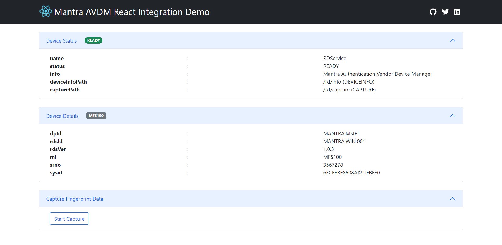
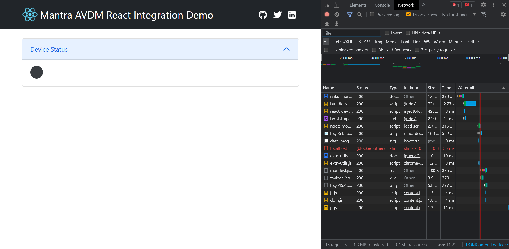

# Mantra React

Mantra AVDM integration demo for React application. This application is bootstrap with [create-react-app](https://create-react-app.dev/).

## Running The Application

- Use `npm install` to install dependencies.
- Use `npm start` to run the app in the development mode.
- Open [http://localhost:3000](http://localhost:3000) to view it in your browser.

## Setup

### System Information

- [Node](https://nodejs.org/en/) : v16.13.0
- [Yarn](https://yarnpkg.com/) : 1.22.17

### Frameworks / Guides

- [React](https://reactjs.org/) : 17.0.2
- [Redux](https://redux.js.org/) : 7.2.6
- [ReactBootstrap](https://react-bootstrap.github.io/) : 2.1.1
- [Bootstrap](https://getbootstrap.com/) : 5.1.3
- [ReactFontAwesome](https://fontawesome.com/v5.15/how-to-use/on-the-web/using-with/react) : 0.1.16

## Debugging

- API requests to RD service in user's machine (user's localhost) may fail with error `blocked:other` if an ad-blocker is active, please turn off the ad-blocker to proceed.

  
